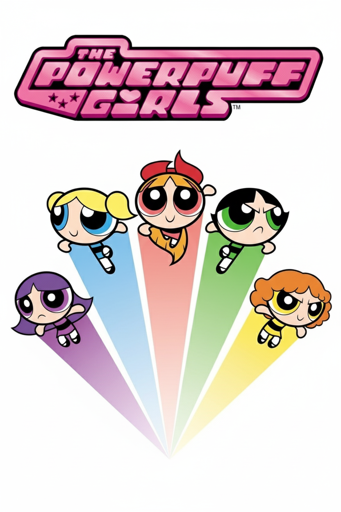

TEMPLATE FOR RETROSPECTIVE (Team 05)
=====================================

The retrospective should include _at least_ the following
sections:

- [process measures](#process-measures)
- [quality measures](#quality-measures)
- [general assessment](#assessment)

## PROCESS MEASURES 

### Macro statistics

- Number of stories committed vs. done = 3 vs 3 
- Total points committed vs. done = 9 vs 9
- Nr of hours planned vs. spent (as a team) = 56h 20m vs 45h 55m

**Remember**a story is done ONLY if it fits the Definition of Done:
 
- Unit Tests passing
- Code review completed
- Code present on VCS
- End-to-End (and Integration) tests performed

> Please refine your DoD if required (you cannot remove items!) 

### Detailed statistics

| Story            | # Tasks | Points    | Hours est.   | Hours actual |
|--------|--------|------------|--------------|--------------|
| _Uncategorized_  |10      |      -      |25h 20m       |26h 5m        |
| Get tickets      |5       |3           |10h 30m       |5h 5m         |  
| Next customer    |6       |3           |11h           |6h            |
| Call customer    |5       |3           |9h 30m       |8h 45m        |

> story `Uncategorized` is for technical tasks, leave out story points (not applicable in this case)

- Hours per task average, standard deviation (estimate and actual)

|            | Mean | StDev |
|------------|------|-------|
| Estimation |   2h 10m   |   1h 59m    | 
| Actual     |   1h 56m   |    2h 7m   |

- Total estimation error ratio: sum of total hours spent / sum of total hours effort - 1

    $$\frac{\sum_i spent_{task_i}}{\sum_i estimation_{task_i}} - 1$$ = -0.185 
    
- Absolute relative task estimation error: sum( abs( spent-task-i / estimation-task-i - 1))/n

    $$\frac{1}{n}\sum_i^n \left| \frac{spent_{task_i}}{estimation_task_i}-1 \right| $$ = 0.372
  
## QUALITY MEASURES 

- Unit Testing:
  - Total hours estimated = 6h
  - Total hours spent = 3h 20m
  - Nr of automated unit test cases = 3
  - Coverage = 60%
- E2E testing:
  - Total hours estimated = 6h
  - Total hours spent = 2h 30m
  - Nr of test cases = 2
- Code review 
  - Total hours estimated =  7h 30m
  - Total hours spent = 4h
  

## ASSESSMENT

- What did go wrong in the sprint?
  > We did not assign all the tasks immediately (as we should have done) and it impacted on our work, other than that we didn't consider the "Demo preparation" in the task estimation. We should have made the tasks smaller and more precise/descriptive.

- What caused your errors in estimation (if any)?
  > Lack of experience on the task estimation procedure and also on the technology to use for some of the tasks. 

- What lessons did you learn (both positive and negative) in this sprint?
  > - We have to split tasks in a better way (smaller chunks) and we should discuss more on decisions regarding the general aspects of the project.
  > - We majorly had good communication in the team

- Which improvement goals set in the previous retrospective were you able to achieve? 
  > XXX
  
- Which ones you were not able to achieve? Why?
  > XXX

- Improvement goals for the next sprint and how to achieve them (technical tasks, team coordination, etc.)

  > - We need to work better during the sprint planning (especially for the task definition, estimation and assignment)
  >  - We need to focus better on team-work instead than just splitting the work among the group members

- One thing you are proud of as a Team !!
  > We are Powerpuff Girls, we overcame all problems that arose without blaming someone and helped each other
  
  
